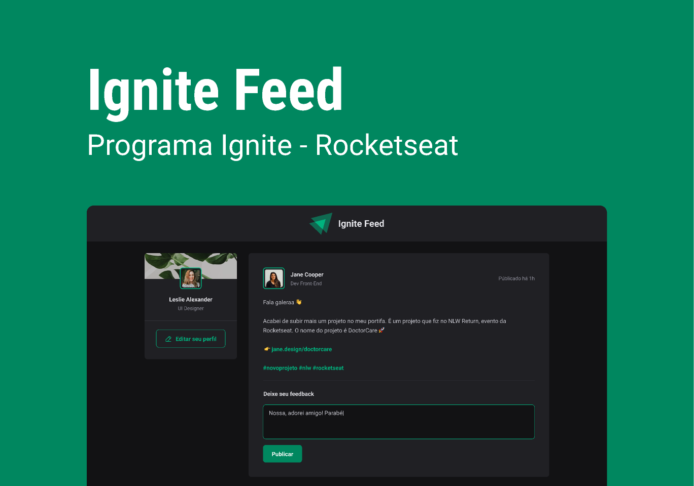

# IgnFeed
## Simple page in React - Posts

<h1 align="center">
    
</h1>

#### Esta página não tem funcionalidade.
#### A mesma simula adição de posts vindo dos usuários que fazem comentários acerca do que foi postado.
#### Outras pessoas podem dar "likes" ao visualizar a mensagem.
#### O número de likes é exibido em tela.
#### Também temos a opção de exclusão de comentários.

