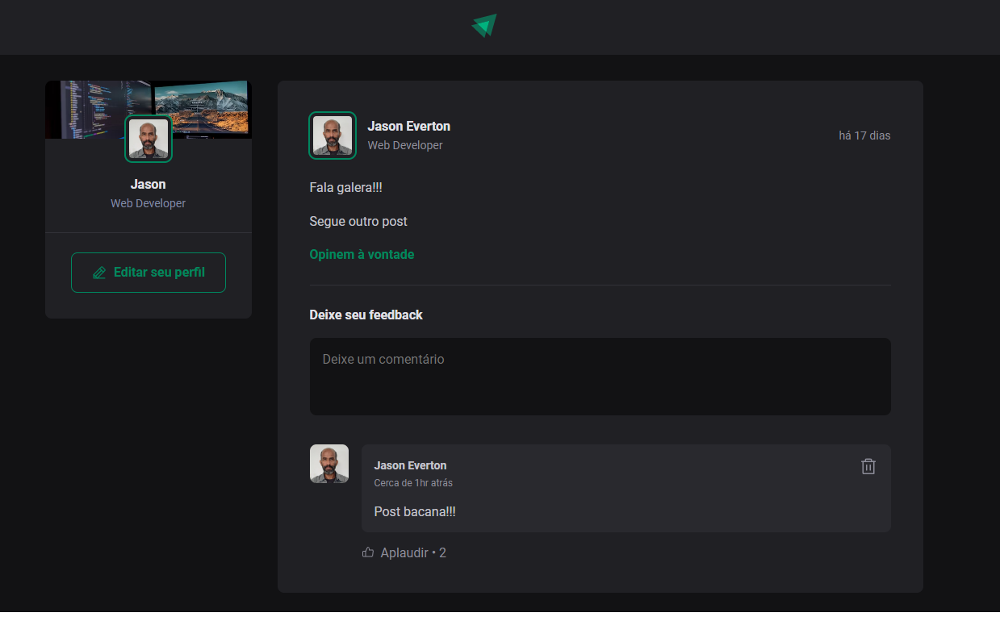

# Ignite Feed

O **Ignite Feed** é um projeto desenvolvido durante o programa **Ignite** da Rocketseat, com o objetivo de praticar os fundamentos do React e construir uma aplicação simples, moderna e funcional.  
O projeto simula uma pequena rede social, onde usuários podem publicar posts, interagir por meio de comentários e curtir conteúdos.

---

## 📸 Screenshots

### 🖼 Tela Inicial


### 🖼 Post e Comentários



---

## 🚀 Tecnologias utilizadas

- **ReactJS** — criação de componentes, estado e propriedades  
- **Vite** — ambiente de desenvolvimento rápido  
- **TypeScript** — tipagem estática e prevenção de erros  
- **CSS Modules** — estilização por componente  
- **Phosphor Icons** — ícones modernos  
- **Date-fns** — manipulação de datas  

---

## 🧩 Principais funcionalidades

### 📄 Publicação de Posts
- Exibição do autor  
- Data de publicação formatada  
- Conteúdo dividido em parágrafos e links  

### 💬 Sistema de Comentários
- Adicionar comentários  
- Excluir comentários  
- Validação contra envio vazio  
- Contador automático  

### 👍 Função de Aplaudir
- Likes independentes por comentário  
- Atualização utilizando imutabilidade  

### 🧠 Estado e Imutabilidade
- Uso de `useState`  
- Atualização segura de listas  
- Re-renderização baseada no estado  

### 🎨 Estilização Modular
- CSS Modules  
- Classes isoladas por componente  

### 📱 Responsividade
- Ajustes para telas menores  
- Layout adaptado  

---


## 🏁 Como executar o projeto

```bash
# Clone o repositório
git clone https://github.com/JsnEvt/IgnFeed.git

# Instale as dependências
npm install

# Inicie o servidor de desenvolvimento
npm run dev
```

Acesse em:
👉 http://localhost:5173

🎯 Objetivo educacional

Este projeto reforça:

Componentização

Estado, props e renderização

Imutabilidade

Organização de pastas

TypeScript aplicado ao React

Estilização modular

## 👨‍💻 Autor
Este projeto foi desenvolvido por **Jason Santos**, como parte das práticas do curso **Ignite da Rocketseat**.

